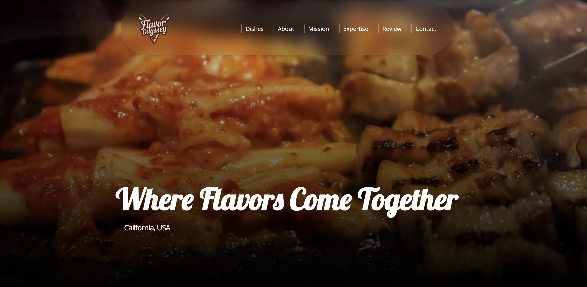

# Flavor Odyssey



Flavor Odyssey is a web application for a restaurant, built using React.js and Tailwind CSS. The application showcases the restaurant's diverse menu, culinary journey, and mission statement, providing an inviting online presence for potential customers.

## Live Demo

Check out the live demo of the application [here](https://magic-meal.netlify.app/).

## Features

- Dishes: Detailed descriptions and images of the restaurant's dishes.
- About: Information about the restaurant's culinary journey.
- Mission: The restaurant's mission statement.
- Expertise: Highlights of the restaurant's culinary expertise.
- Review: Reviews from food critics.
- Contact: Contact information and social media links.

## Technologies Used

- React.js: A JavaScript library for building user interfaces.
- Tailwind CSS: A utility-first CSS framework for styling.
- React Icons: For social media icons.

### Installation

1. Clone the repo:

```bash
git clone https://github.com/annan-dejene/Flavor-Odyssey.git
cd Flavor-Odyssey
```

2. Install dependencies:

```node
npm install
```

3. Start the dev server:

```node
npm run dev
```
